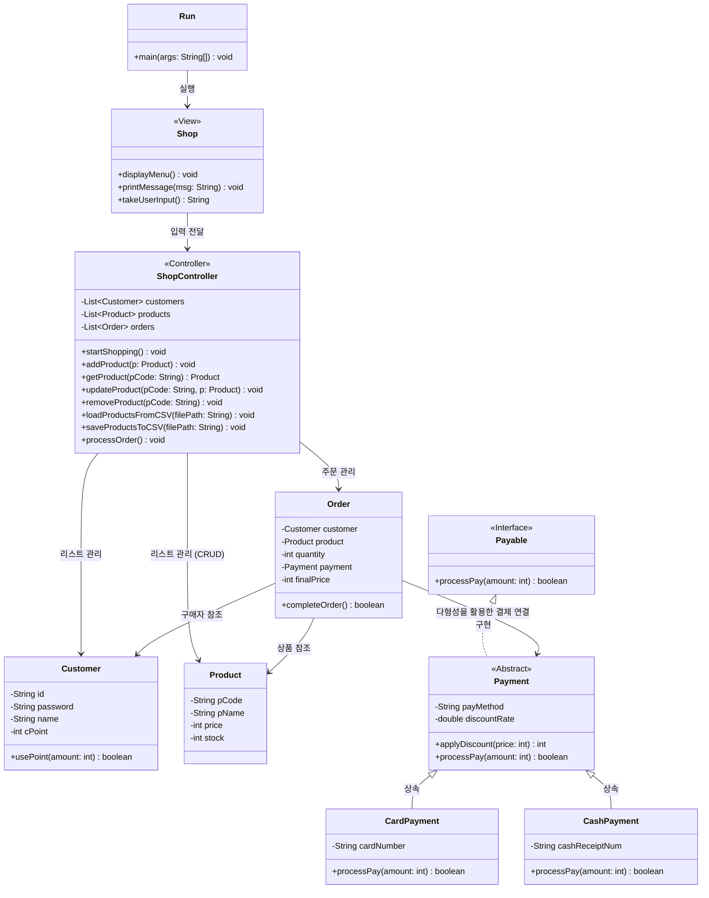

# 0626 과제

객체 지향에는 4가지 특징(추상화, 캡슐화, 상속성, 다형성)이 있다.
위 특징들은 프로그램의 유지보수성을 높이고 각 객체들의 독립성을 높여 보다 유연한 프로그램을 만들 수 있도록 한다.

추상화 Abstraction

- 현실 세계에서 프로그램을 만드는데 필요한 핵심 속성과 기능을 뽑아 클래스로 만드는 과정
    
    불필요한 세부 사항을 제거하고, 공통적이고 중요한 부분을 찾아내는것이 좋다.
    

캡슐화(Encapsulation)

- 특정 기능(method)과 그 기능에 필요한 데이터를 캡슐처럼 클래스로 묶는 것
    
    외부에서 데이터에 접근하지 못하도록 은닉하여 데이터를 보호하고, 독립성을 높일 수 있다.
    

상속성(Inheritance)

- 이미 작성된 클래스의 특성과 기능을 새로운 클래스에 그대로 물려받게끔 하여 사용하는 것.
    
    기존에 있는 코드를 재사용하기에 중복 코드가 줄어들고, 필요한 기능만 필요할때 꺼내서 이용 가능하다.
    

다형성(Polymorphism)

- 하나의 변수혹은 메소드가 상황에 따라 여러 가지 동작을 할 수 있는 성질
    
    오버로딩/오버라이딩 같이 동일한 명령도 객체의 종류에 따라 다르게 반응하도록 만들 수 있다.
    

미니 프로젝트 주제 : 쇼핑몰
주제 선정 이유
→ 지금 듣는 Python & Elasticsearch 기반 금융솔루션 개발자 아카데미에 맞춰서 쇼핑몰을 한 번 구상해보고 싶었음.

